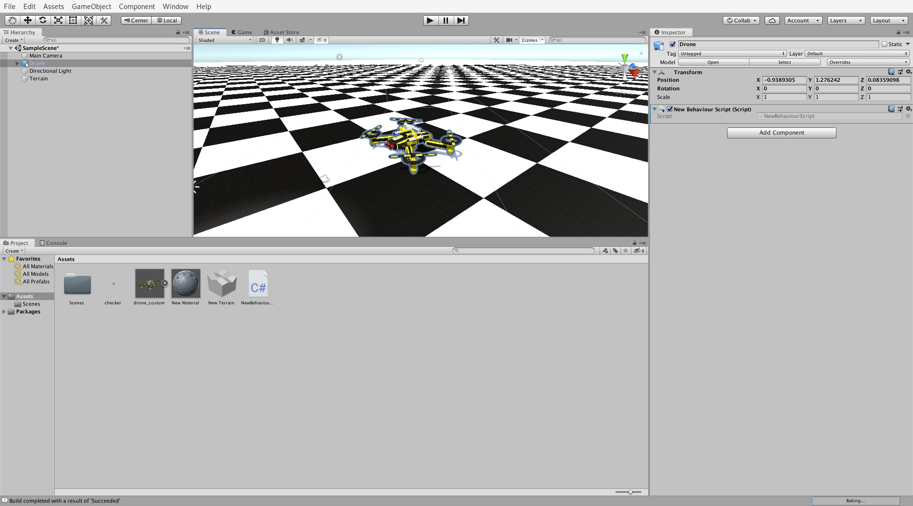
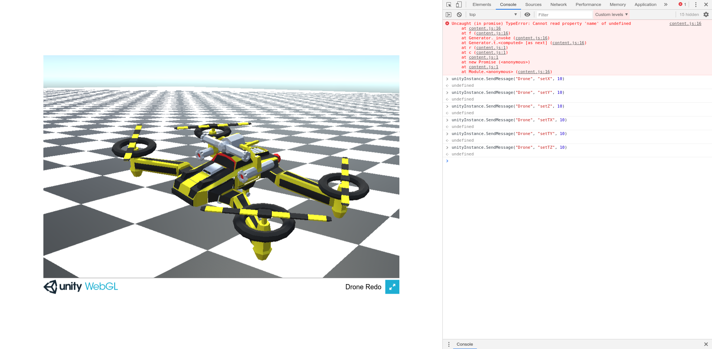

# Run and interact with a Unity scene on SWT

## Install Unity

Depending on your distribution, you might be able to use your available package manager to install the components needed.
Please note that, if you use your package manager to install Unity Editor, you might need to also install the plugin for WebGL Support separately.

### Install UnityHub

UnityHub is an application used to manage Unity licenses and different versions.
You will not be able to run Unity officially without it.

It is released as an AppImage, that you can download [here]https://public-cdn.cloud.unity3d.com/hub/prod/UnityHub.AppImage).
Make it executable (`chmod u+x UnityHub.AppImage`), and run it.

In order to get a license, click on `Preferences`, `License Management`, then the `Manual Installation` button.
You can save a license request file, then upload it to https://license.unity3d.com/manual and obtain a valid license file for `Unity Personal Edition`.

### Install Unity Editor

Once you have imported your license file, go back to the main menu of UnityHub and go into the `Installs` menu.
Click `Add` and select the latest stable version of Unity.
On the next screen, select the `WebGL Build Support` and click on `Done`.

## Example project: quadcopter

From UnityHub, create a new 3D project.
Unity Editor should then open.

### Import drone model

The model used in this example is available [here](https://free3d.com/3d-model/drone-costume-411845.html).

**You will need to have `Blender` installed on your computer in order to import the `.blend` version of the model.**

Go to `Assets > Import New Asset...` and select the `drone_costum.blend` file.
The drone should appear in the list of assets, at the bottom of the screen.
Drag and drop it into the scene.

### Script interactions

We will use messages in order to interact with the scene.
A message takes parameters:
- a target object
- a method to call on the object
- a parameter for the method

In order to use messages, we first need to define the methods that can be called on an object.
Right click on the `Assets` view at the bottom, `Create > C# Script`.

We want to set the coordinates and the orientation of the drone.
One way to do it is to implement the `Update` method, that will be called periodically on the object, and use `transform.SetPositionAndRotation` with arguments stored by calls to setters.
The messages we will then sent will use the setters as callbacks.

Example:
```cs
using System.Collections;
using System.Collections.Generic;
using UnityEngine;

public class drone_move : MonoBehaviour
{
    float x = 0.0f;
    float y = 0.0f;
    float z = 0.0f;
    float tx = 0.0f;
    float ty = 0.0f;
    float tz = 0.0f;

    void setX(float i) {
        x = i;
    }

    void setY(float i) {
        y = i;
    }

    void setZ(float i) {
        z = i;
    }

    void setTX(float i) {
        tx = i;
    }

    void setTY(float i) {
        ty = i;
    }

    void setTZ(float i) {
        tz = i;
    }

    void Start()
    {

    }

    void Update() {
        transform.SetPositionAndRotation(new Vector3(x, y, z), Quaternion.Euler(new Vector3(tx, ty, tz)));
    }
}
```

Left click on the drone, `Add Component`, and add your newly created script.
Also, give a name to your drone (this will be useful later).

### Optional: Add a floor

Without a floor, it might be hard to actually notice the object moving.

Go to `GameObject > 3D Object > Terrain` to create a terrain.
Copy/paste it (or move it) to cover the whole surface of the drone.

Now you have a floor, but invisible...
`Assets > Create > Material` to create the material that the floor will use, then select a terrain tile.
On the right side of the window, click on the gear (`Terrain Settings`)`.
Around `Basic Terrain > Material`, click on the ring and select the material you created.

The last step is to set a texture on the material.
I used a 2x2 pixels image with 2 white dots and 2 black dots.
`Assets > Import New Asset...` and select the image file you want to use.
Once imported, you might want to set the Filter Mode of the new texture to `Point (no filter)`.

Click on the material, `Main Maps > Albedo`, click on the circle and select the texture.
Edit `Main Maps > Tiling` as you wish.

 *Unity Editor view with the final model*

### Export WebGL

You should start by disabling the scene automatic light computing before trying to export anyhting, or your export might get stuck...
`Window > Rendering > Lighting Settings`, and disable `Realtime Global Illumination` and `Baked Global Illumination`

`File > Build Settings > WebGL > Switch Platform`, then `Build and Run` and chose where to export your build.

## Testing

Once the build is done, Unity should start a local server and open your web browser with your model displayed.
You can check that everything is ok by opening your browser console and send messages to your drone:

```js
unityInstance.SendMessage("Drone", "setX", 10)
unityInstance.SendMessage("Drone", "setY", 10)
unityInstance.SendMessage("Drone", "setZ", 10)
unityInstance.SendMessage("Drone", "setTX", 10)
unityInstance.SendMessage("Drone", "setTY", 10)
unityInstance.SendMessage("Drone", "setTZ", 10)
```
(`Drone` is the name I gave to my drone)

The 6 commands should have an effect on the drone.

 *WebGL model running and JS interaction*

## Run on SWT

You can run your WebGL model on SWT using a `Browser`:

```java
Display display = new Display();
Shell shell = new Shell(display);
shell.setLayout(new FillLayout());

Browser browser = new Browser(shell, SWT.NONE);
browser.setUrl("file://" + location + "/unity/webgl/index.html");

shell.open();
```

You can then interact with your running instance by using the `execute` method:
```java
// Send messages to set the 6 coordinates of the Drone object
browser.execute("unityInstance.SendMessage('Drone', 'setX', " + x + ");\n"
       + "unityInstance.SendMessage('Drone', 'setY', " + y + ");\n"
       + "unityInstance.SendMessage('Drone', 'setZ', " + z + ");\n"
       + "unityInstance.SendMessage('Drone', 'setTX', " + tx + ");\n"
       + "unityInstance.SendMessage('Drone', 'setTY', " + ty + ");\n"
       + "unityInstance.SendMessage('Drone', 'setTZ', " + tz + ");");
```
